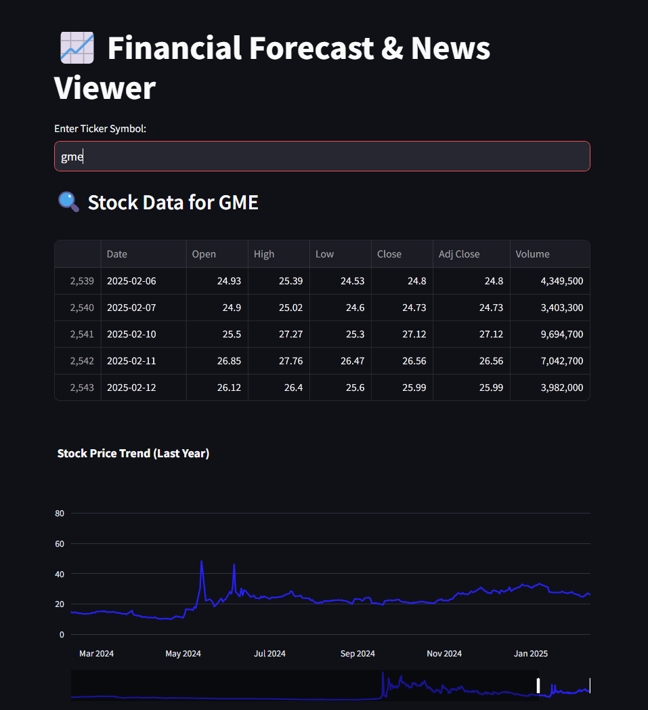
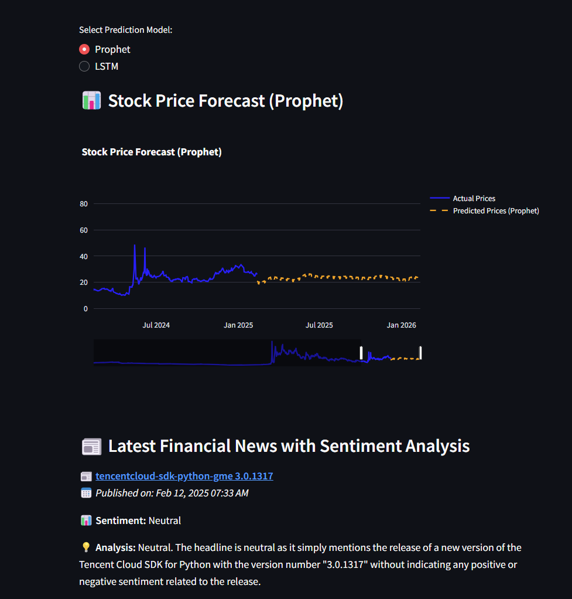

# **Stock Forecasting & Sentiment Analysis**  

A web application for predicting stock prices and analyzing market sentiment using machine learning and deep learning models. Built with **Streamlit** for the UI, **Yahoo Finance** for data retrieval, and both **Facebook Prophet** (Bayesian forecasting) and **LSTM (PyTorch)** for time-series prediction.  

### **Features**  
- Compare forecasting models by selecting between **Prophet (statistical model)** and **LSTM (deep learning)** to predict stock trends  
- Interactive visualizations using **Plotly** to display historical stock trends and predicted future prices  
- Market sentiment analysis using **GPT-3.5**, which analyzes financial news headlines and classifies them as positive, negative, or neutral  
- Real-time data retrieval from **Yahoo Finance API**  

---

## Demo Screenshots

### Stock Selection and Data Display


### Stock Prediction & Sentiment Analysis



### **Installation**  

Ensure all dependencies are installed from **requirements.txt** (recommended inside a virtual environment). Prophet requires additional dependencies—refer to [Prophet Installation Guide](https://facebook.github.io/prophet/docs/installation.html).  

```sh
# Create and activate a virtual environment (optional but recommended)
python -m venv env
source env/bin/activate  # Mac/Linux
env\Scripts\activate  # Windows

# Install dependencies
pip install -r requirements.txt
```

### **Run the Application**  
```sh
streamlit run main.py
```

---